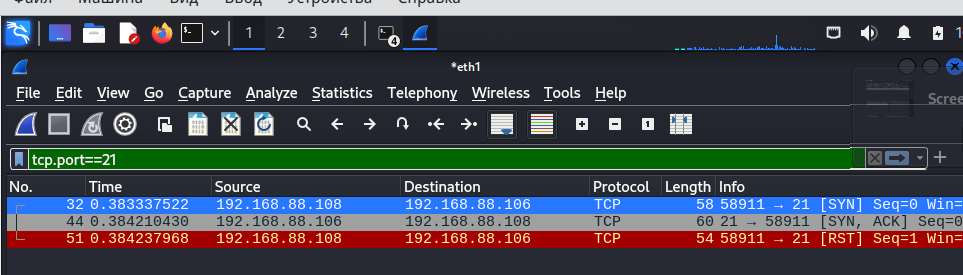
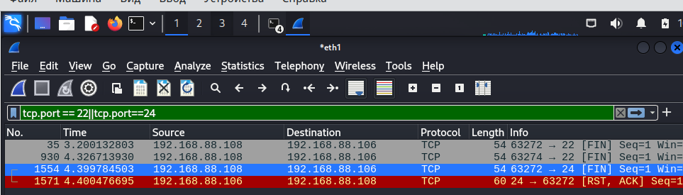
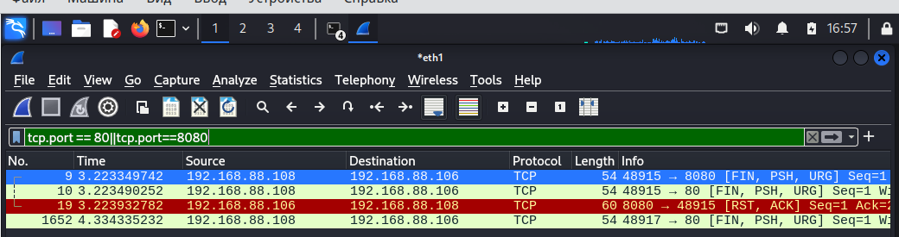
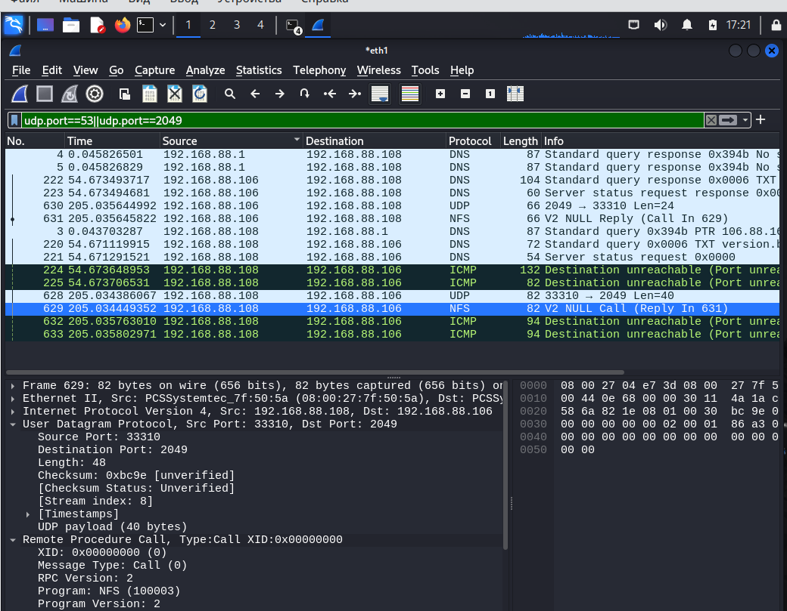

# Домашнее задание к занятию "`Уязвимости и атаки на информационные системы`" - `Дунаев Дмитрий`


### Инструкция по выполнению домашнего задания

   1. Сделайте `fork` данного репозитория к себе в Github и переименуйте его по названию или номеру занятия, например, https://github.com/имя-вашего-репозитория/git-hw или  https://github.com/имя-вашего-репозитория/7-1-ansible-hw).
   2. Выполните клонирование данного репозитория к себе на ПК с помощью команды `git clone`.
   3. Выполните домашнее задание и заполните у себя локально этот файл README.md:
      - впишите вверху название занятия и вашу фамилию и имя
      - в каждом задании добавьте решение в требуемом виде (текст/код/скриншоты/ссылка)
      - для корректного добавления скриншотов воспользуйтесь [инструкцией "Как вставить скриншот в шаблон с решением](https://github.com/netology-code/sys-pattern-homework/blob/main/screen-instruction.md)
      - при оформлении используйте возможности языка разметки md (коротко об этом можно посмотреть в [инструкции  по MarkDown](https://github.com/netology-code/sys-pattern-homework/blob/main/md-instruction.md))
   4. После завершения работы над домашним заданием сделайте коммит (`git commit -m "comment"`) и отправьте его на Github (`git push origin`);
   5. Для проверки домашнего задания преподавателем в личном кабинете прикрепите и отправьте ссылку на решение в виде md-файла в вашем Github.
   6. Любые вопросы по выполнению заданий спрашивайте в чате учебной группы и/или в разделе “Вопросы по заданию” в личном кабинете.
   
Желаем успехов в выполнении домашнего задания!
   
### Дополнительные материалы, которые могут быть полезны для выполнения задания

1. [Руководство по оформлению Markdown файлов](https://gist.github.com/Jekins/2bf2d0638163f1294637#Code)

---

### Задание 1

Скачайте и установите виртуальную машину Metasploitable: https://sourceforge.net/projects/metasploitable/.

Это типовая ОС для экспериментов в области информационной безопасности, с которой следует начать при анализе уязвимостей.

Просканируйте эту виртуальную машину, используя **nmap**.

Попробуйте найти уязвимости, которым подвержена эта виртуальная машина.

Сами уязвимости можно поискать на сайте https://www.exploit-db.com/.

Для этого нужно в поиске ввести название сетевой службы, обнаруженной на атакуемой машине, и выбрать подходящие по версии уязвимости.

Ответьте на следующие вопросы:

- Какие сетевые службы в ней разрешены?
- Какие уязвимости были вами обнаружены? (список со ссылками: достаточно трёх уязвимостей)
  
*Приведите ответ в свободной форме.*  

---

### Решение 1

Была создана и поднята виртуальная машина в VirtualBox из образа "Metasploitable2", настроен сетевой адаптер с адресом 192.168.88.106 в режиме моста в сеть с хостовой ОС. Аналогично поднята kali linux 2024 для сканирования и экспериментов, ip 192.168.88.108.

Было проведено сканирование с помощью nmap (с опцией -A). В системе довольно много служб, таких как веб-сервер apache, FTP-сервер, сервер СУБД, DNS-сервер и т.п. Вывод сканирования при помощи nmap:
```
┌──(kali㉿kali)-[~]
└─$ nmap -A 192.168.88.106
Starting Nmap 7.94SVN ( https://nmap.org ) at 2024-06-24 14:36 EDT
Nmap scan report for 192.168.88.106
Host is up (0.00013s latency).
Not shown: 977 closed tcp ports (conn-refused)
PORT     STATE SERVICE     VERSION
21/tcp   open  ftp         vsftpd 2.3.4
|_ftp-anon: Anonymous FTP login allowed (FTP code 230)
| ftp-syst: 
|   STAT: 
| FTP server status:
|      Connected to 192.168.88.108
|      Logged in as ftp
|      TYPE: ASCII
|      No session bandwidth limit
|      Session timeout in seconds is 300
|      Control connection is plain text
|      Data connections will be plain text
|      vsFTPd 2.3.4 - secure, fast, stable
|_End of status
22/tcp   open  ssh         OpenSSH 4.7p1 Debian 8ubuntu1 (protocol 2.0)
| ssh-hostkey: 
|   1024 60:0f:cf:e1:c0:5f:6a:74:d6:90:24:fa:c4:d5:6c:cd (DSA)
|_  2048 56:56:24:0f:21:1d:de:a7:2b:ae:61:b1:24:3d:e8:f3 (RSA)
23/tcp   open  telnet      Linux telnetd
25/tcp   open  smtp        Postfix smtpd
|_ssl-date: 2024-06-24T18:37:00+00:00; +2s from scanner time.
| sslv2: 
|   SSLv2 supported
|   ciphers: 
|     SSL2_DES_64_CBC_WITH_MD5
|     SSL2_RC2_128_CBC_WITH_MD5
|     SSL2_RC4_128_EXPORT40_WITH_MD5
|     SSL2_RC4_128_WITH_MD5
|     SSL2_RC2_128_CBC_EXPORT40_WITH_MD5
|_    SSL2_DES_192_EDE3_CBC_WITH_MD5
|_smtp-commands: metasploitable.localdomain, PIPELINING, SIZE 10240000, VRFY, ETRN, STARTTLS, ENHANCEDSTATUSCODES, 8BITMIME, DSN
| ssl-cert: Subject: commonName=ubuntu804-base.localdomain/organizationName=OCOSA/stateOrProvinceName=There is no such thing outside US/countryName=XX
| Not valid before: 2010-03-17T14:07:45
|_Not valid after:  2010-04-16T14:07:45
53/tcp   open  domain      ISC BIND 9.4.2
| dns-nsid: 
|_  bind.version: 9.4.2
80/tcp   open  http        Apache httpd 2.2.8 ((Ubuntu) DAV/2)
|_http-title: Metasploitable2 - Linux
|_http-server-header: Apache/2.2.8 (Ubuntu) DAV/2
111/tcp  open  rpcbind     2 (RPC #100000)
| rpcinfo: 
|   program version    port/proto  service
|   100000  2            111/tcp   rpcbind
|   100000  2            111/udp   rpcbind
|   100003  2,3,4       2049/tcp   nfs
|   100003  2,3,4       2049/udp   nfs
|   100005  1,2,3      34021/udp   mountd
|   100005  1,2,3      37817/tcp   mountd
|   100021  1,3,4      42794/udp   nlockmgr
|   100021  1,3,4      53937/tcp   nlockmgr
|   100024  1          33261/udp   status
|_  100024  1          59009/tcp   status
139/tcp  open  netbios-ssn Samba smbd 3.X - 4.X (workgroup: WORKGROUP)
445/tcp  open  netbios-ssn Samba smbd 3.0.20-Debian (workgroup: WORKGROUP)
512/tcp  open  exec        netkit-rsh rexecd
513/tcp  open  login       OpenBSD or Solaris rlogind
514/tcp  open  tcpwrapped
1099/tcp open  java-rmi    GNU Classpath grmiregistry
1524/tcp open  bindshell   Metasploitable root shell
2049/tcp open  nfs         2-4 (RPC #100003)
2121/tcp open  ftp         ProFTPD 1.3.1
3306/tcp open  mysql       MySQL 5.0.51a-3ubuntu5
| mysql-info: 
|   Protocol: 10
|   Version: 5.0.51a-3ubuntu5
|   Thread ID: 9
|   Capabilities flags: 43564
|   Some Capabilities: Speaks41ProtocolNew, SwitchToSSLAfterHandshake, ConnectWithDatabase, LongColumnFlag, SupportsTransactions, Support41Auth, SupportsCompression
|   Status: Autocommit
|_  Salt: 6r_bPHYfu:]H/P&jgD^-
5432/tcp open  postgresql  PostgreSQL DB 8.3.0 - 8.3.7
| ssl-cert: Subject: commonName=ubuntu804-base.localdomain/organizationName=OCOSA/stateOrProvinceName=There is no such thing outside US/countryName=XX
| Not valid before: 2010-03-17T14:07:45
|_Not valid after:  2010-04-16T14:07:45
|_ssl-date: 2024-06-24T18:37:00+00:00; +2s from scanner time.
5900/tcp open  vnc         VNC (protocol 3.3)
| vnc-info: 
|   Protocol version: 3.3
|   Security types: 
|_    VNC Authentication (2)
6000/tcp open  X11         (access denied)
6667/tcp open  irc         UnrealIRCd
8009/tcp open  ajp13       Apache Jserv (Protocol v1.3)
|_ajp-methods: Failed to get a valid response for the OPTION request
8180/tcp open  http        Apache Tomcat/Coyote JSP engine 1.1
|_http-favicon: Apache Tomcat
|_http-title: Apache Tomcat/5.5
|_http-server-header: Apache-Coyote/1.1
Service Info: Hosts:  metasploitable.localdomain, irc.Metasploitable.LAN; OSs: Unix, Linux; CPE: cpe:/o:linux:linux_kernel

Host script results:
|_nbstat: NetBIOS name: METASPLOITABLE, NetBIOS user: <unknown>, NetBIOS MAC: <unknown> (unknown)
| smb-os-discovery: 
|   OS: Unix (Samba 3.0.20-Debian)
|   Computer name: metasploitable
|   NetBIOS computer name: 
|   Domain name: localdomain
|   FQDN: metasploitable.localdomain
|_  System time: 2024-06-24T14:36:51-04:00
|_smb2-time: Protocol negotiation failed (SMB2)
|_clock-skew: mean: 1h00m01s, deviation: 2h00m00s, median: 1s
| smb-security-mode: 
|   account_used: <blank>
|   authentication_level: user
|   challenge_response: supported
|_  message_signing: disabled (dangerous, but default)

Service detection performed. Please report any incorrect results at https://nmap.org/submit/ .
Nmap done: 1 IP address (1 host up) scanned in 21.01 seconds
```

Некоторые обнаруженные уязвимости:

1. [vsftpd 2.3.4 - Backdoor Command Execution](https://www.exploit-db.com/exploits/49757)

2. [BIND 9.4.1 < 9.4.2 - Remote DNS Cache Poisoning (Metasploit)](https://www.exploit-db.com/exploits/6122)

3. [Apache < 2.2.34 / < 2.4.27 - OPTIONS Memory Leak](https://www.exploit-db.com/exploits/42745)

4. [MySQL 5.0.75 - 'sql_parse.cc' Multiple Format String Vulnerabilities](https://www.exploit-db.com/exploits/33077s)

---

### Задание 2

Проведите сканирование Metasploitable в режимах SYN, FIN, Xmas, UDP.

Запишите сеансы сканирования в Wireshark.

Ответьте на следующие вопросы:

- Чем отличаются эти режимы сканирования с точки зрения сетевого трафика?
- Как отвечает сервер?

---

### Решение 2

1. nmap -sS (SYN)

SYN - при отправке с хоста с nmap пакета SYN, если удаленный хост отвечает пакетом с флагами SYN, ACK, то это говорит о том, что порт прослушивается, сервер отвечает и готов установить соединение. На примере порта 21 на скриншоте:



2. nmap -sF (FIN)

FIN - флаг завершения соединения, если удаленный хост отвечает пакетом с флагами RST, ACK, то это говорит о том, что порт закрыт, если же игнорирует, то порт открыт. На примере портов 22 и закрытого 24 на скриншоте:



3. nmap -sX (Xmas)

Устанавливаются FIN, PSH и URG флаги. Порты в nmap могут помечаться как open|filtered, т.е. сканер не может однозначно определить закрыт порт или открыт. Некоторые системы посылают RST ответы на запросы не зависимо от того, открыт порт или закрыт. Это приводит к тому, что все порты помечаются как закрытые. Основными системами ведущими себя подобным образом являются Microsoft Windows, многие устройства Cisco, BSDI и IBM OS/400. На скриншоте фильтр по портам 80 и 8080:



4. nmap -sU (UDP)

UDP - режим. В отличие от предыдущих занимает довольно продолжительное время. Использует UDP-датаграммы вместо TCP-пакетов.
При таком сканировании nmap отправляется UDP-пакет без данных (no payload) на каждый порт, и, если не получает ошибки icmp port unreachable, значит порт открыт. С учетом того, что это UDP - сканировние занимает огромное количество времени по сравнению с пердыдущими рассмотренными методами (более 1000 секунд по сравнению с несколькими в случае с TCP). На скриншоте порты 53 и 2049:


